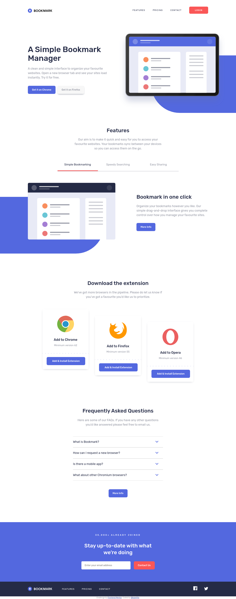

# Frontend Mentor - Bookmark landing page solution

This is a solution to the [Bookmark landing page challenge on Frontend Mentor](https://www.frontendmentor.io/challenges/bookmark-landing-page-5d0b588a9edda32581d29158). Frontend Mentor challenges help you improve your coding skills by building realistic projects. 

## Table of contents

- [Overview](#overview)
  - [The challenge](#the-challenge)
  - [Screenshot](#screenshot)
  - [Links](#links)
- [My process](#my-process)
  - [Built with](#built-with)
  - [What I learned](#what-i-learned)
  - [Useful resources](#useful-resources)
- [Author](#author)

**Note: Delete this note and update the table of contents based on what sections you keep.**

## Overview

### The challenge

Users should be able to:

- View the optimal layout for the site depending on their device's screen size
- See hover states for all interactive elements on the page
- Receive an error message when the newsletter form is submitted if:
  - The input field is empty
  - The email address is not formatted correctly

### Screenshot

### Links

- Solution URL: [Frontend Mentor](https://your-solution-url.com)
- Live Site URL: [Preview](https://kazetita.github.io/FEM-Bookmark-Landing-Page/)

## My process

### Built with

- Semantic HTML5 markup
- CSS custom properties
- Flexbox
- Mobile-first workflow
- SASS/SCSS
- PostCSS
- Gulp

### What I learned
- PostCSS.
- Gulp.
- Validating forms using the constraint validation API.

### Useful resources

- [Client-side form validation](https://developer.mozilla.org/en-US/docs/Learn/Forms/Form_validation) - This helped me permorf custom form validation.
- [Modern CSS Reset](https://piccalil.li/blog/a-modern-css-reset/) - This is a basic reset that makes our lives easier. 

## Author

- Frontend Mentor - [@kazetita](https://www.frontendmentor.io/profile/kazetita)

